# Siggraph 2019 Optix 7 Course Tutorial Code

This tutorial was created to accompany the 2019 Siggraph course on
"RTX Accelerated Ray Tracing with OptiX" (slides will soon be added
below). 

The aim of this repo is to serve as a "tutorial" in how to set
up a full Scene - ie, Optix Context, Module, Programs, Pipeline,
Shader Binding Table (SBT), Accel Struct (AS), Build Inputs, Texture
Samplers, etc, in the newly introduced Optix 7. 

To do this, this repo intentionally does not provide *one* example
that has the final code, but instead is split into 10 smaller
examples, each of which modifies and extends the previous one,
hopefully in a way that it is relatively easy to spot the differences
(ie, to spot what exactly had to be added to go from "A" to "B").

Note this tutorial does (intentionally) not end in a overwhelming
wow-factor full-featured renderer - it's aim is to *only* help you get
*started* with Optix 7, exactly up to the point where "Textbook Ray Tracing 101" would usually kick in.  

With that - enjoy!

PS: I tried my best to make sure that code is correct, and will work
out of the box in both Linux and Windows. However, I assume it's safe
to expect that soem one or other bug has crept in somewhere that I
haven't found yet. If you do find one, please feel free to let me know
via email or bug report, or send a push request, so others will be
spared from finding it again. Of course, any other feedback is
welcome, too!


# Building the Code

This code was intentionally written with minimal dependencies,
requiring pretty much only CMake (as a build system), your favorite
compiler (tested with Visual Studio under Windows, and GCC under
Linux), and of course the Optix 7 SDK (including CUDA 10.1 and the
most recent NVIDIA developer driver).

## Dependencies

- a compiler
  - On windows, tested with Visual Studio 2019 community edition
  - On Linux, tested with Ubuntu 18 and Ubuntu 19 default gcc installs
- CUDA 10.1
  - Download from developer.nvidia.com
  - on Linux, suggest to put `/usr/local/cuda/bin` into your `PATH`
- latest NVIDIA developer driver that comes with the SDK
  - download from http://developer.intel.com/optix
- Optix 7 SDK
  - download from http://developer.intel.com/optix
  - on linux, suggest to set the environment variable `OptiX_INSTALL_DIR` to wherever you installed the SDK.  
  `export OptiX_INSTALL_DIR=<wherever you installed Optix 7.0 SDK>`
  - on windows, the installer shuld automatically put it into the right directory

The literally only *external* library we use is GLFW for windowing, and
even this one we actually build on the fly under Windows, so installing
it is only required under Linux. 

Detailed steps below:

## Building under Linux

- Install required packages
```
    sudo apt install libglfw3-dev cmake-curses-gui
```
- Clone the code
```
    git clone http://gitlab.com/ingowald/optix7course
    cd optix6course
```

- create (and enter) a build directory
```
    mkdir build
    cd build
```

- configure with cmake
```
    ccmake ..
```

- and build
```
    make
```

## Buiding under Windows

- Install Required Packages
	- see above: CUDA 10.1, Optix 7 SDK, latest driver, and cmake
- download or clone the source repository
- Open `CMake GUI` from your start menu
	- point "source directory" to the downloaded source directory
	- point "build directory" do <source directory>/build (agree to create this directory when prompted)
	- click 'configure'. If CUDA, SDK, and compiler are all properly installed this should enable the 'generate' button. If not, make sure all dependencies are properly installed, "clear cache", and re-configure.
	- click 'generate' (this creates a visual studio project and solutions)
	- click 'open project' (this should open the project in visual studio)


# Examples Overview
	
## Example 1: Hello World 

This is simplest example, that only initializes the Optix Library,
prints "hello world", and exits. It's pretty much only testing whether
your SDK, driver, and PATH/LD_LIBRARY_PATH are properly set up to
build, link, and run this tutorial.

This is how this should look like in Linux:
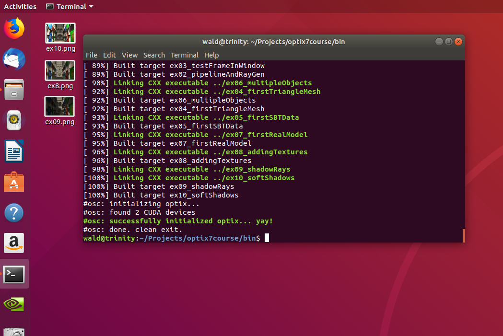

And here, in Windows:
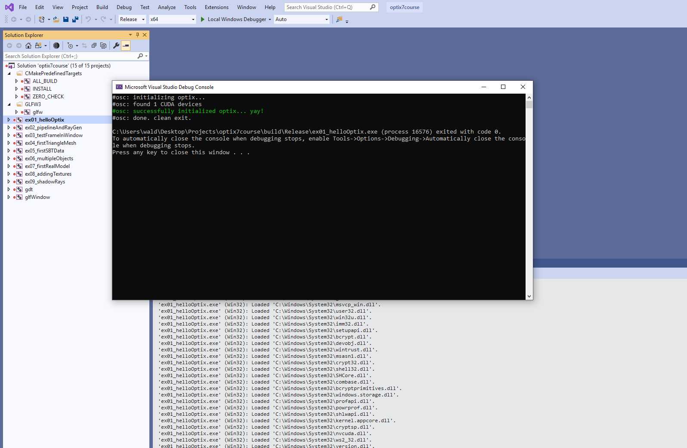

## Example 2: First Pipeline Setup and Raygen Program

This is the first "real" OptiX example, and maybe somewhat
surprisingly, the biggest "step" in all of the examples. 

The actual raygen program that this example launches is actually
very(!) small, and pretty much trivial; and there's no other programs,
not even geometry, nor a single ray being traced ... but to launch
this simple raygen program we nevertheless have to go through the
entire process of creating Modules, Programs, and, in particular, a
valid "Shader Binding Table" (SBT), before we can launch our little
raygen sample.

On the upside: Once this initial setup is done, everything will get
*much* simpler in the following examples.

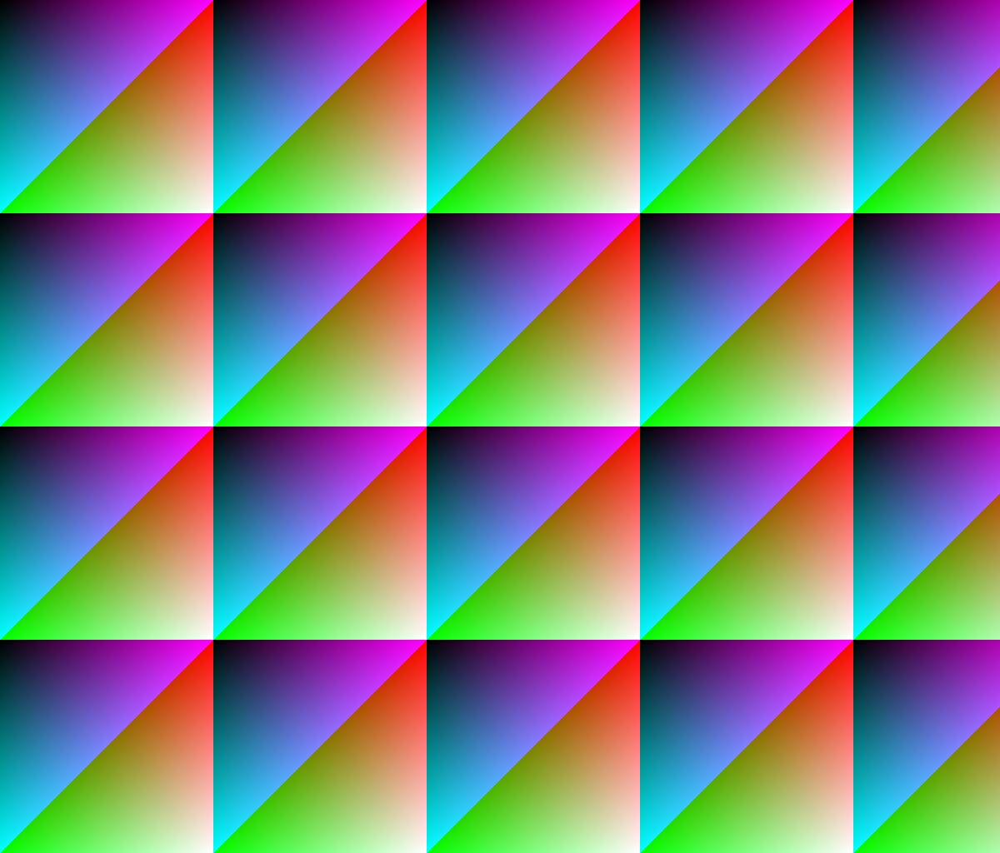

## Example 3: Rendering in a GLFW Window 

Rendering to files is nice and well, but *probably* you want to
eventually do some online rendering; so this example moves the
previous raygen example into a 3D viewer window (created and run using
GLFW). For now this viewer just displays the rendererd images (ie,
nothing changes from frame to frame); I'm going to add some user
interaction after Siggraph is over.

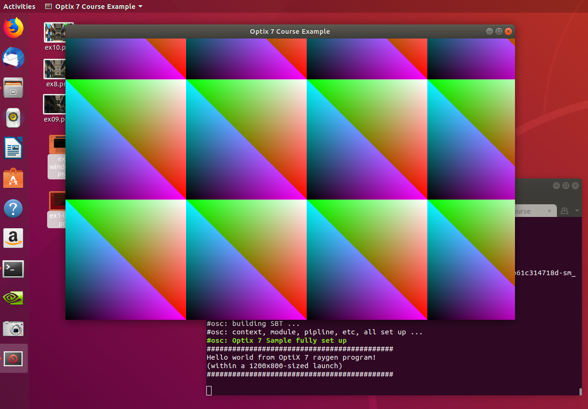
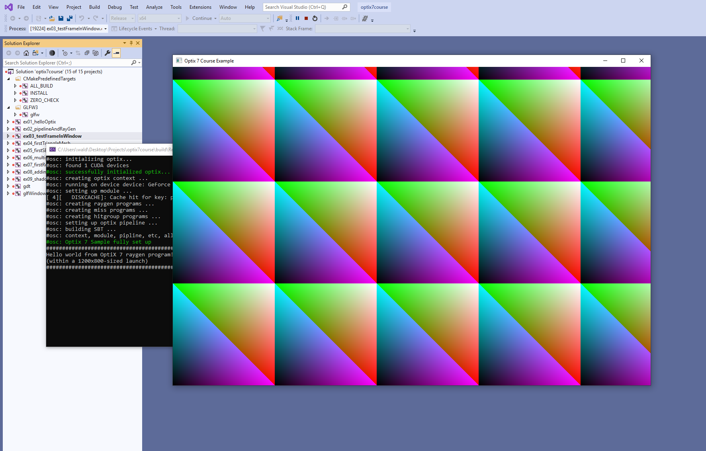

## Example 4: Creating a first Triangle Mesh and Accel Struct 

Though the previous setup steps were important to get right, eventually 
you want to use a ray tracer to trace some real rays against some
real geometry. 

This example introduces how to create some Triangle Mesh Geometry (in
this example, two simple, hardcoded, cubes), how to build an
Acceleration structure over this "BuildInput", and how to trace rays
against. To do this it also needs to introdue a simple camera model.

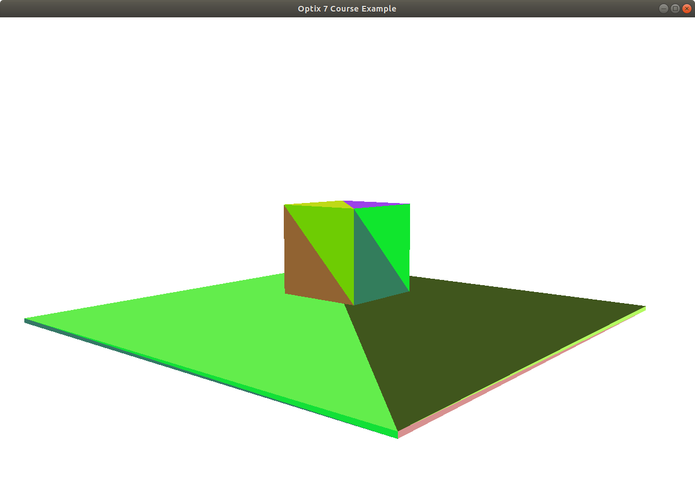

## Example 5: First Shader Binding Table (SBT) Data 

The earlier examples *created* an SBT (they had to, else they couldn't
have executed any optix launch); but didn't actually put any data into
the SBT. This example introduces how to do that, by putting just some
simple constant per-object color into the mesh's SBT entry.

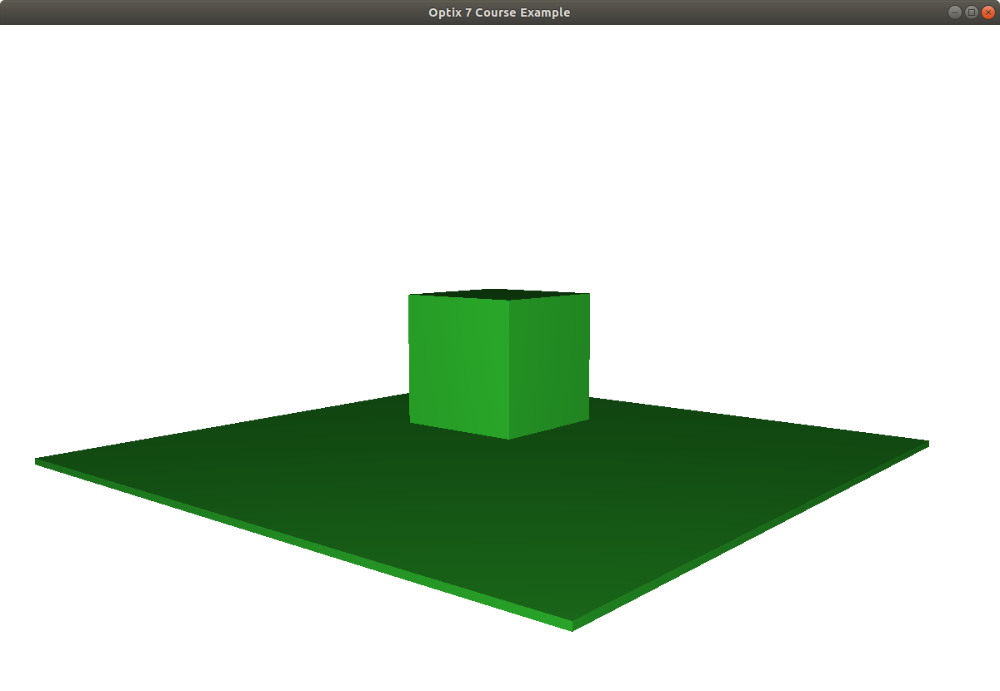

## Example 6: Multiple Triangle Meshes 

This example introduces the concept of having multipel different
meshes (each with their own programs and SBT data) into the same accel
structure. Whereas the previous example used two (same color) cubes in
*one* triangle mesh, this example split this test scene into two
meshes with one cube (and one color) each.

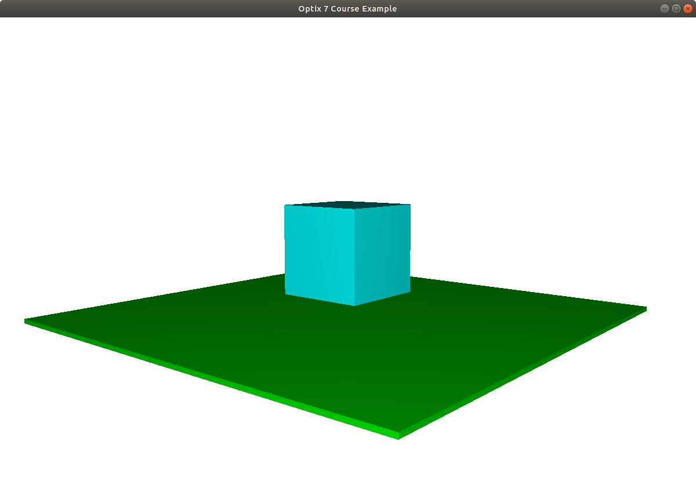

## Example 7: First Real Model

This example takes the previous "multiple meshes" code unmodified, but
introduces a simple OBJ file format parser (using Syoyo Fuyita's
tinyobj [insert link]), and hooks the resulting triangle meshes up to
the previous example's render code.

And la-voila, with exactly the same render code from Sample 6, it
suddently starts to take shape:

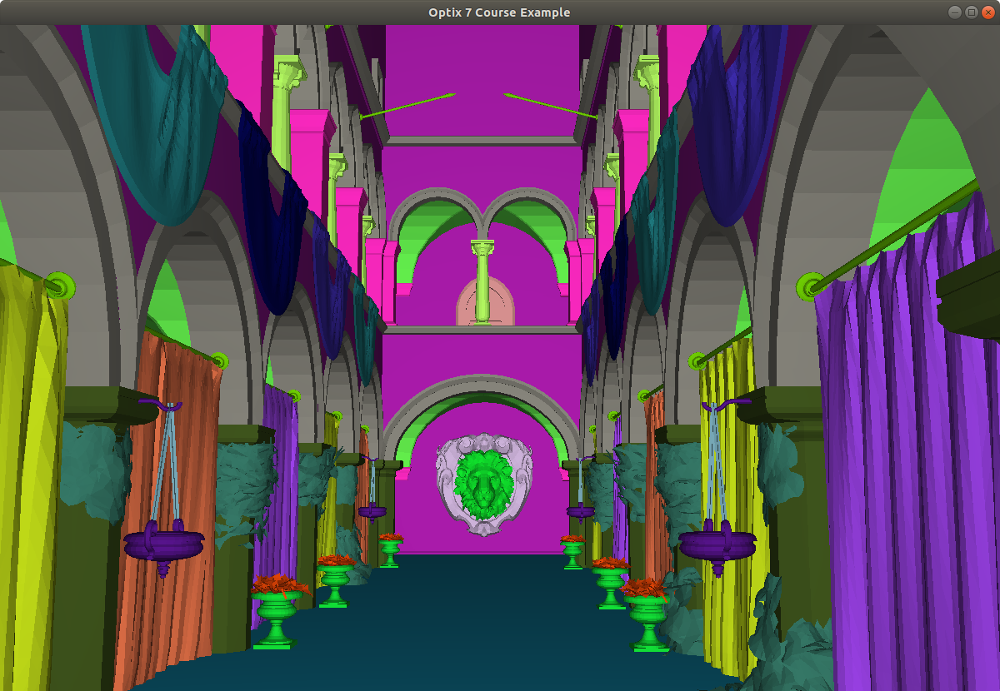

## Example 8: Adding Textures via CUDA Texture Objects

This example shows how to create and set up CUDA texture objects on
the host, host to pass those to the device via the SBT, and how to use
those texture objects on the device.

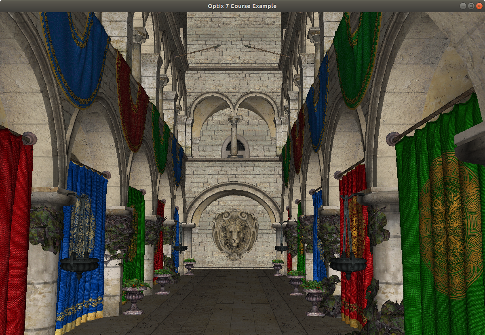

## Example 9: Adding a second ray type: Shadows

This is the last example that focusses on host-side setup, in this
case adding a second ray type (for shadow rays), which also requires
to change the way the SBT is being built. 

This sample also shows how to shoot secondary rays (the shadow rays)
in device programs, how to use an any-hit program for the shadow rays,
how to call *optixTerminateRay* from within an anyhit program, and how
to use the optixTrace call's SBT index/offset values to specify the
ray type.

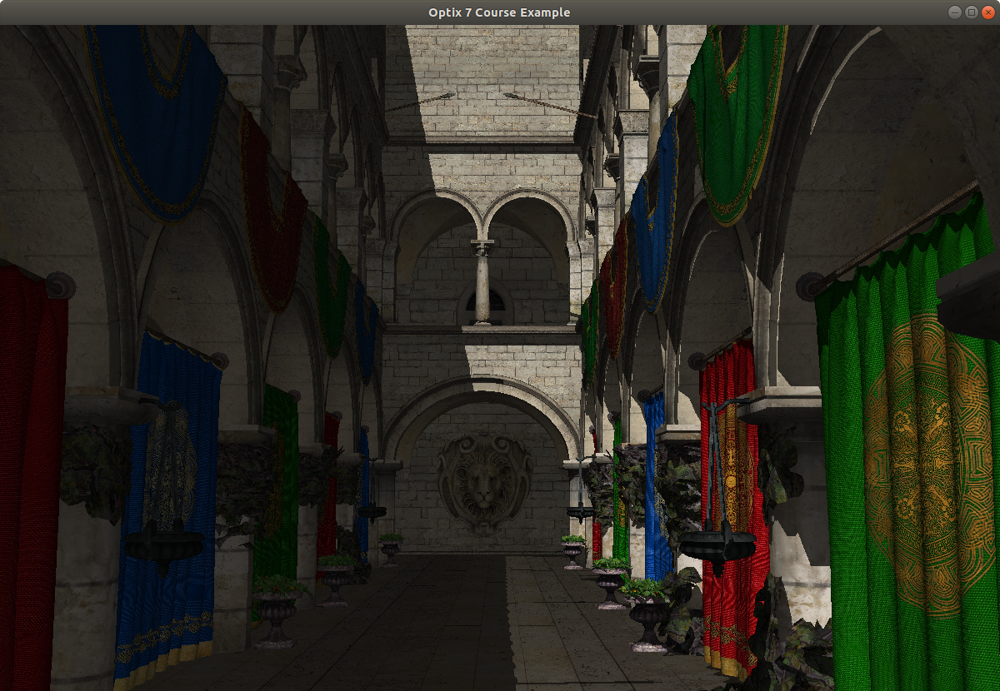

## Example 10: Soft Shadows

Whereas the first 9 examples focussed on how to perform all the
required host-side setup for various incremental features, this
example can now start to focus more on the "ray tracing 101" style
additions that focus what rays to trace to add certain rendering
effects. 

This simple example intentionally only adds soft shadows from area lights, but extending this to add reflections, refraction, diffuse bounces, better material models/BRDFs etc show from now on be rather straightforward. 

Please feel free to play with adding these examples... and share what
you did!

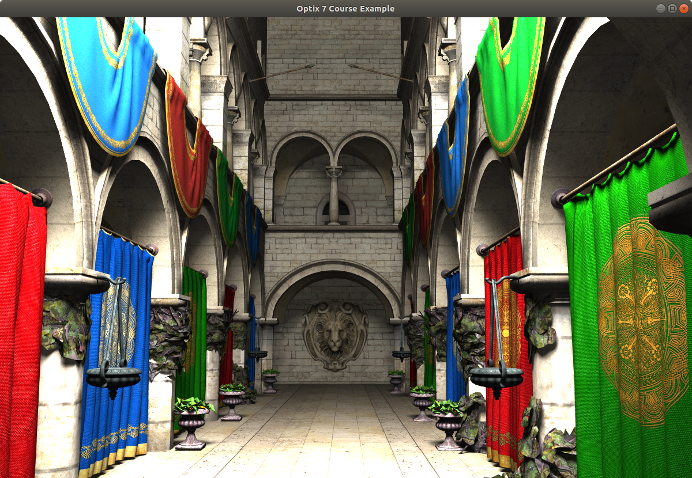

## Example 11: It's up to you ...

From here on, there are multiple different avenues of how to add to
this very simple viewer, both in terms of visual features,
performance, kind and complexity of geometry, etc. In no particular
order, and just to serve as an inspiration:

- Performance
   - Multi-GPU
   - Denoising
   - Better random numbers, better sampling, importance sampling, ...
   - ...

- Shading Effects
   - More/better light sources (eventually with importance sampling for multiple lights!)
   - Better camera model, with depth of field 
   - Alpha/Transparency Textures for Cut-outs (Tip: often used in landscape scenes)
   - Better material model / BRDF
   - Indirect Illumination / path tracing
   - ...
   
- Geometry-related Capabilities
   - Instancing, possibly multi-level instancing
   - Animation
   - Motion Blur
   - ...

- Viewer/app extensions
   - Camera motion based on user input
   - More importers (PBRT parser?)
   - Picking and editing
   - ...

Whichever of these - or other - features you might want to play around with: Let me know how it works out ... and have fun doing it!

